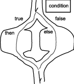
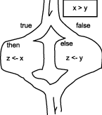
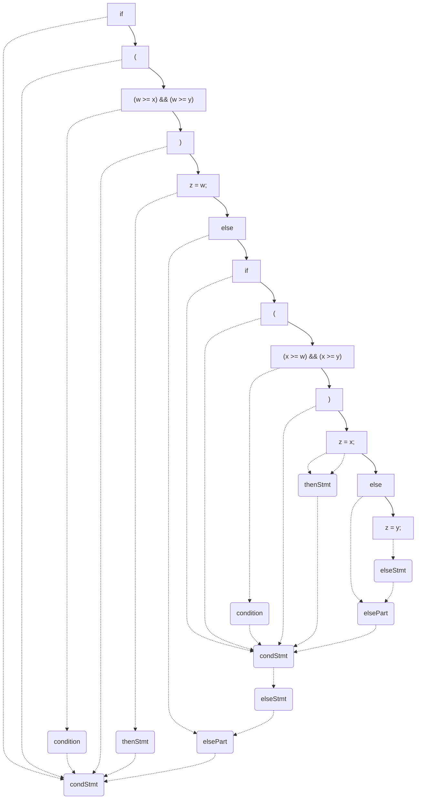

# About this module

-   Prerequisites: [0012](../0012/mdModule.html)

-   Objectives: This module explores conditions and conditional
    statements in programming.

# Why?

Conditional statements are important because they permit a program to
follow different paths based on the outcome of conditions. In other
words, conditional statements give programs the ability to "choose".

# Conditions

A condition is essentially a question that can only have one of two
answers: "true" or "false". I choose to use "true" and "false" instead
of "yes" and "no" for a reason. Let us examine this question:

Is variable `x` greater than variable `y`?

Obviously, the answer is either "yes" or "no". However, let me change
the question just a little, as follows:

Is variable `x` not greater than variable `y`?

Although the proper answer is still either "yes" or "no", it depends
greatly on the (natural) language. In English, for example, if `x > y`,
then the proper answer to "Is variable `x` not greater than `y`?" is "yes". However, in some other languages, the proper
answer is "no". This is why "yes" and "no" are not really good answers.

As a result, it is better to pose questions as follows:

Is it true or false that `x > y`?

We can now flip the question as follows: Is it true or false that `x` is
not greater than `y`?

It is important to remember that in programming, `x > y` is not an assertion; it is a question. That is, `x > y` is not saying that
`x` is actually greater than `y`, but rather asking the question "is it
true that `x` is greater than `y`". This means that `x > y` in
programming should have been `x ?>? y`, just to make it
clear.

## Comparisons

The first and more primitive kind of condition consists of the comparison
operators. This is a list of comparison operators that exist in all
programming languages:

-   `>`: greater than.
-   `<`: less than.
-   `>=`: greater than or equal to. 
-   `<=`: less than or equal to.
-   `!=`: not equal to. In Visual Basic, SQL and Pascal, it is represented by `<>` (less than or greater than).
-   `==`: equal to.

It is important to distinguish `=` from `==` in a C-derived language.
This topic is out of scope in this module. However, it suffices to say
that this is a source of many defects in programming.

These comparison operators take two values, one on each side of the
operators.

## Logical operators

Although comparison operators are useful, they cannot express all the
conditions that a program requires. However, we'll get back to this
topic later.

# Conditional statements

Let's try to express the logic to compute the maximum of two variables,
`x` and `y`, and put that maximum value in variable `z`. This kind of
logic cannot be expressed by sequential statements because whether `z`
should receive the value of `x` or the value of `y` *depends* on the
relationship of `x` and `y`.

I think we have enough suspense already. The proper code for this logic
is as follows:

```c
// algorithm findmax2
if (x > y) // line 1
  z = x;   // line 2
else       // line 3
  z = y;   // line 4
```

Line 1 expresses the question of whether `x` is
greater than `y`. Line
2 is the statement that executes if and
only if `x` is actually greater than `y` (`X > y` is true). Line
4 is the statement that executes if and
only if `x` is *not* actually greater than `y` (`x > y` is false). Line
3 is merely a separator marker to separate the
statement groups. Line

Also, note that the statements on line
2 and line
4 are "indented". This means that they are
shifted a little to the right-hand side. The purpose of indentation is
to indicate how a statement "embeds" another one. This will become more
important later.

A conditional statement is also graphically presented as follows:

 

Note that this is not a
flowchart but rather a "trail map". There is no special symbol to
remember! In this picture, the condition is a question of a post before
entering the fork. One path of the fork is chosen based on the answer to
the question (on the post). If the answer is "true," then the left path
is chosen. If the answer is "false," then the right path is chosen. The
bubble on the left-hand side is labeled "then"; it represents whatever
needs to be done if the answer is "true." Likewise, the bubble on the
right-hand side is labeled "else"; it represents whatever needs to be
done if the answer is "false."

Given this template, we can substitute the proper condition and actions
for algorithm `findmax2`. The resulting trail map is presented as follows:



# The syntax of a conditional statement

* *`condStmt`* ::= **if (** *`condition`* **)** *`thenStmt`* *`elsePart`*<sub>opt</sub>
* *`thenStmt`* ::= *`statement`*
* *`elsePart`* ::= **else** *`elseStmt`*
* *`elseStmt`* ::= *`statement`*
* *`statement`* ::= *`condStmt`*

*`condStmt`* is a conditional statement. *`condition`* is a condition, which is also known as an expression that evaluates to true or false. *`thenStmt`* is the "then statement," it executes if and only if `*condition`* is true. *`elsePart`* is an optional part of specifying an else statement. *`elseStmt`* is the "else statement," it executes if and only if *`condition`* is false.

The last rule specifies that a *`statement`* can expand to a *`condStmt`* (conditional statement). 

# Logical operators

Although comparison operators are important and useful, they are not
sufficient to express all the different kinds of conditions needed in
programming. Let us think about the logic to figure out the maximum `z`
of three variables `w`, `x` and `y`.

We know that we need to rely on a conditional statement. In fact, we can
guess the overall form of the statement (in algorithm template findmax3).

```c
// algorithm findmax3 template
if (_c1_)      // line 1
  z = w;       // line 2
else if (_c2_) // line 3
  z = x;       // line 4
else           // line 5
  z = y;       // line 6
```

The notations `_c1_` on line 1 and `_c2_` are placeholders for two conditions that we need to figure out.
Line 2 should execute if and only if `w` is the maximum. Similar logic
applies to lines 4 and 5. Let us focus on line 2 for now.

How can we confirm that `w` is the maximum? If `w >= x` and `w >= y`,
then by definition, `w` is the maximum. But how do we express this as
`_c1_`?

The syntax to do this is `(w >= x) && (w >= y)`. The symbol `&&` means "and," also known as "conjunction" in mathematics.

## How to say "true" and "false"

In C++, the literal constant value to specify true is simply **true** as a terminal. Similarly, **false** is the terminal to specify the value of false.

Any value that is **true** or **false** is also known as a _boolean_ value.

## Conjunction

"Conjunction" is an operator that has two sides. The entire
expression is true if and only if both sides are true. In English, a
conjunction is "and". In C and other C-derived languages, the
conjunction operator is `&&`. In Pascal, SQL, and Visual Basic, the
operator is simply spelled as `AND`.

The four possible combinations are as follows:

-   `true && true` is true
-   `true && false` is false
-   `false && true` is false
-   `false && false` is false

This can also be summarized in a truth table as follows:

|`x`|`y`|`x && y`|
|-|-|-|
|`false`|`false`|`false`|
|`false`|`true`|`false`|
|`true`|`false`|`false`|
|`true`|`true`|`true`|

In this table, `x` and `y` are _independent variables_, meaning their values do not depend on each other. Each row of the table shows the value of the boolean expression `x && y` given the values of `x` and `y` specified on the same row.


## Disjunction

Disjunction is the English word "or". This operator also requires two
sides. The entire disjunction expression is true if and only if at least
one side is true. In C and other C-derived languages, the disjunction operator is
`\|\|`. In Pascal, SQL, and Visual Basic, the operator is simply spelled as
`OR`.

The four possible combinations are as follows:

-   `false \|\| false` is `false`
-   `false \|\| true` is `true`
-   `true \|\| false` is `true`
-   `true \|\| true` is `true`

This can also be summarized in a truth table as follows:

|`x`|`y`|`x \|\| y`|
|-|-|-|
|`false`|`false`|`false`|
|`false`|`true`|`true`|
|`true`|`false`|`true`|
|`true`|`true`|`true`|


## Negation

Negation is the English word "not". This operator only has one side (on
the right-hand side). A negation expression is true if and only if the
value of the right-hand side is false. In C and other C-derived languages, the operator is `!`
(exclamation point). In Pascal, SQL, and Visual Basic, the operator is
spelled out as `NOT`.

The two possible combinations are as follows:

-   `!false` is `true`
-   `!true` is `false`

This can also be summarized in a truth table as follows:

|`x`|`!x`|
|-|-|
|`false`|`true`|
|`true`|`false`|

# Back to the example

Getting back to the example to compute the maximum of three variables,
we can now utilize the conjunction operator as in the following code.

```c
// algorithm findmax3
if ((w >= x) && (w >= y))      // line 1
  z = w;                       // line 2
else if ((x >= w) && (x >= y)) // line 3
  z = x;                       // line 4
else                           // line 5
  z = y;                       // line 6
```

Now that the algorithm is finished, let us try to trace it. In our first
example, let us assume `w==2`, `x==2` and `y==2. Although this is a
trivial case, a trace of the algorithm illustrates a conditional
statement with multiple conditions.

|line #|`w`|`x`|`y`|`z`|comments|
|:-|:-|:-|:-|:-|:-|
|pre|2|2|2|?|`z` has an unknown value|
|1| | | | |`2 >= 2` is true, the condition is true|
|2| | | |2|`z` is updated by `w`|
|post| | | | | |

This example illustrates one very important point. In a complex
conditional statement, even though multiple conditions may be true, only
the statement matching the first (in top-to-bottom order) true condition
executes.

Now, it is your turn to work out the next example. Assume `w==2`, `x==3`, and `y==3`. Create a trace table that shows exactly which lines get
executed.

## What is "Else if"?

In algorithm `findmax3`, we use a construct that was not present in
algorithm `findmax2`. What exactly is "else if"? 

Let us rewrite algorithm `findmax3` in a slightly different format.

```c
// algorithm findmax3
if ((w >= x) && (w >= y))      // line 1
  z = w;                       // line 2
else                           // line 3
  if ((x >= w) && (x >= y))    // line 4
    z = x;                     // line 5
  else                         // line 6
    z = y;                     // line 7
```

Most programming languages like C++ and Java ignore indentations and how a program is broken into lines. This new way to express `findmax3` is functionally identical to the earlier one. However, the indentations in this newer version are structurally correct. There are two conditional statements, one is nested within the other.

The following is an over-simplified syntax analysis of algorithm `findmax3`. Note how one conditional statement is the *`elseStmt`* of another.




