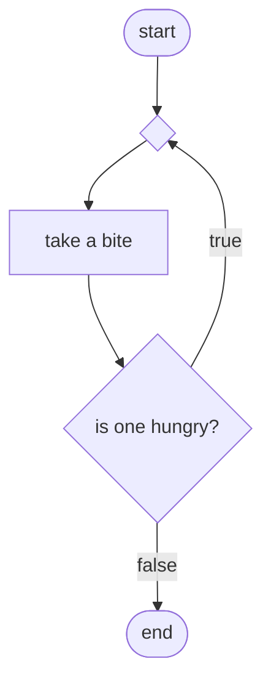
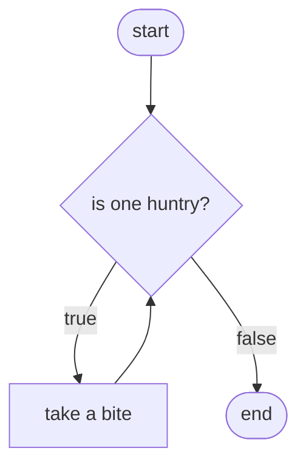

# About this module

-   Prerequisites: [0013](../0013/mdModule.html)
-   Objectives: This module discusses various iterative control
    structures.

# What is a loop, again?

A loop is a control structure that permits certain steps in a program to
be repeated. Without loops, programs cannot perform certain steps again
and again, often without knowing exactly the number of times to repeat.

In real life, we often rely on loops as well. For example, the logic of
eating is iterative. Let's think about eating a relatively large order
of food. The basic step is "eat a spoonful" (or whatever quantum of food
you want to use). Ahead of time, we don't know exactly how many
spoonfuls is necessary. The proper logic to eat a meal is "eat as many
spoonfuls as possible until you feel full".

# Repeat that, again!

Let us explore loops, again. However, this time, we use a special kind
of structure. Let us take a look at the following algorithm that specifies the logic to eat.

```c
do                    // line 1
  take a bite         // line 2
while (one is hungry) // line 3
```

Now, let's take a closer look at this block of code.

-   line 1: this is a "marker" that marks the
    beginning of actions to be repeated.
-   line
    2: this line serves two purposes.
    First, the word "until" is a marker that marks the end of actions to
    be repeated. Second, this line expresses the condition that
    specifies when the action should not be repeated anymore.
-   line 3: this is the action to be repeated. In
    general, there can be exactly one statement between the markers
    "do" and "while".

No explanation is complete without a trace. The following trace able
illustrates the steps taken when someone only needs three bites to
become full.

|line #|comment|
|:-|:-|
|1|this is not necessary since it doesn't do anything|
|2|this is the first bite|
|3|the condition is evaluated, one is still hungry|
|1|this part is important, we get back to this line because the condition is true|
|2|this is the second bite|
|3|the condition is still true|
|1|since one is not full yet, here we go again|
|2|this is the third bite|
|3|this time around, one is full, and this condition is false now; *we don't have to take another bite!*|
|post|the algorithm exits|

There is a problem with the above algorithm. What if someone is already full to begin with? A
special property of a "do-while" loop is that the action is performed *at
least once*. This is because the "while" condition is evaluated after
the action is performed.

# The flowchart of a "repeat" loop

The logic of the code in the previous section can be represented by the following flowchart:



# Is this all worth while?

Since we concluded that the previous "eating" algorithm is not perfect, there must be a better
way. What we need is a loop construct that evaluates the condition first
to see if an iteration is necessary, then perform the action only if it
is necessary.

This loop structure is as displayed in the following algorithm.

```c
while (one is hungry) // line 1
  take a bite         // line 2
```

This control structure looks like a "do-while" loop reversed. Let's
explain each line in the new algorithm.

-   line 1: this line is analoguous to line 3 of the "do-while" algorithm. It is a marker to mark the beginning of actions to be performed. It also presents a condition to be evaluated. If this condition is "true" then the action is   performed. If the condition is "false" then the loop terminates.
-   line 2: this line is the action to be *possibly* performed repeatedly. Note that after the action is performed, we go back to line 1 so that we can determine whether it is necessary to perform the action again.

The following table is a trace of algorithm if a person is full (not hungry) to begin with.

|line #|comment|
|:-|:-|
|1|because the person is full already, the condition "one is hungry" is false
|post|when the condition of a "while" loop is false, the loop is terminated.

The following is a flowchart corresponding to the "while" loop algorithm.


# Argh, repeat no more!

Some languages support the concept of "repeat", but C and its derived
languages do not have repeat. Instead, such languages have an "upside
down while". Let us illustrate with an example.

Let us consider algorithm
[\[algorithm:repeatex\]](#algorithm:repeatex){reference-type="ref"
reference="algorithm:repeatex"} as an example.

``` {#algorithm:repeatex .numberLines .pseudocode language="pseudocode" numbers="left" label="algorithm:repeatex" caption="Repeat-until example to illustrate an upside-down while loop."}
repeat
  ask for a ZIP code
until the ZIP code is valid
```

This logic keeps asking for a ZIP code until a valid one is entered.
Note that because this is a repeat-until loop, the action (asking for a
ZIP code) is performed *before* asking the question whether the ZIP code
is valid. This only makes sense.

In C (and its derived languages), this logic is expressed as follows:

    do
    {
      ask for a ZIP code
    } while (ZIP code is not valid);

It doesn't seem very different. Instead of "repeat", we use "while", and
we use "while" to end the construct instead of "until". However, a
closer look reveals a major difference. In the repeat version, the
condition is "the ZIP code is valid". However, in the do-while version,
the condition is "the ZIP code is *not* valid".

In other words, a repeat-until loop specifies an exit condition (when
true, exit). A do-while loop, however, specifies a do-it-again condition
(when true, do it again).
