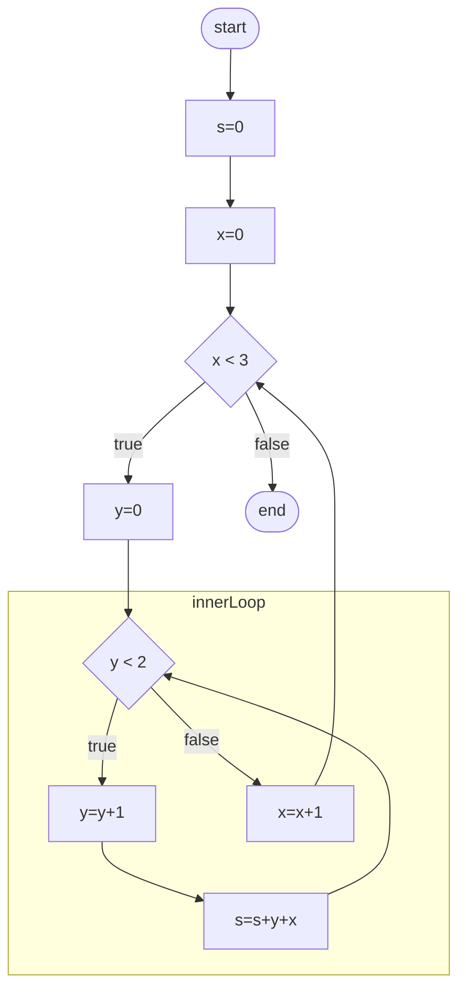

# About this module

-   Prerequisites: [0012](../0012/mdModule.html), [0013](../0013/mdModule.html), [0016](../0016)
-   Objectives: This module introduces the use of nested statements in
    which one or more statements are embedded into another statement.

# Why?

In other modules, we have explored sequences, conditional statements, and
loops. Although each type of statement has its application, they cannot express most algorithms by themselves.

Most algorithms involve the use of nesting. In other words, we can
enclose a statement or statements by another statement. A sequence can
enclose a loop, a loop can enclose a conditional statement, etc. In
fact, there is a limitation as to what kind of statement can embed what
kind of statement. Indeed, a loop and embed another loop!

# An example

Let's begin with an example that we have already seen in another module:

```c
while (x < 5) {  // line 1
  x = x + 1;     // line 2
}                // line 3
```

In this algorithm, line
1 marks the beginning of the prechecking loop,
whereas line 3 marks the end of the block statement of the prechecking loop. The
statement on line 2 is contained within the prechecking loop. We
can say that the assignment statement on line 2 is nested inside a block statement, which is in return, nested in the prechecking loop.

Note that use indentation to indicate that line 2 is contained within the construct that begins on lines 1 and 3. Whenever we nest a statement inside another one, the nested (or embedded) one is indented by one additional level. Although this is not strictly a required pseudocode syntax, it is commonly used and expected.

# A more complex example

Now that we understand the simpler example let us consider a slightly
more complex example:

```c
s = 0;             // line 1
x = 0;             // line 2
while (x < 3) {    // line 3
  y = 0;           // line 4
  while (y < 2) {  // line 5
    y = y + 1;     // line 6
    s = s + y + x; // line 7
  }                // line 8
  x = x + 1;       // line 9
}                  // line 10
```

The indentation shows how the statements are nested. Lines 6 and 7 are the most nested statements. They are
nested within the prechecking loop that begins on line 5 and ends on line 8.

Note that the assignment statements on lines 4 and 9 are "peers" (on the same nesting level) of the prechecking loop that begins on line 5 and ends on line 8.

Everything from line 4 to line 9 is nested inside the outer prechecking loop.

It may be helpful to show a flowchart of this algorithm. 



Of course, no explanation is complete without a trace! 

|line #|`s`|`x`|`y`|comments|
|:-|:-|:-|:-|:-|
|pre|?|?|?|no assumption about the initial value of variables|
|1|0| | | |
|2| |0| | |
|3| | | |`x < 3` is true because x equals 0|
|4| | |0| |
|5| | | |`y < 2` is true because y equals 0|
|6| | |1| |
|7|0| | | |
|5| | | |`y < 2` is true because y equals 1|
|6| | |2| |
|7|1| | | |
|5| | | |`y < 2` is false because y equals 2|
|9| |1| | |
|3| | | |`x < 3` is true because x equals 1|
|4| | |0| |
|5| | | |`y < 2` is true because y equals 0|
|6| | |1| |
|7|3| | | |
|5| | | |`y < 2` is true because y equals 1|
|6| | |2| |
|7|6| | | |
|5| | | |`y < 2` is false because y equals 2|
|9| |2| | |
|3| | | |`x < 3` is true because x equals 2|
|4| | |0| |
|5| | | |`y < 2` is true because y equals 0|
|6| | |1| |
|7|9| | | |
|5| | | |`y < 2` is true because y equals 1|
|6| | |2| |
|7|13| | | |
|5| | | |`y < 2` is false because y equals 2|
|9| |3| | |
|3| | | |`x < 3` is false because x equals 3|
|post| | | | |

# How to interpret nested statements?

When we have nested statements, there are a few points to observe. Because line 7 is the last statement of the block statement that forms the body of the inner loop, the next line to execute is the matching beginning of that loop on line 5. Only when the condition evaluated on line 5 becomes false does the inner loop exit and continue execution on the line after the inner loop, line 9.

As a side note, the lines that only contain a close-brace `}` are not traced. This is because these lines are strictly for ending a block statement from the syntactic perspective. 
