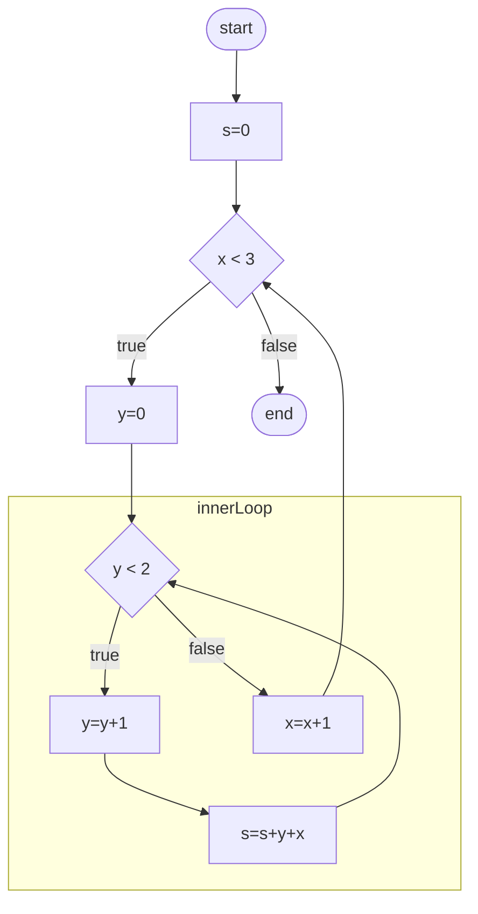

# About this module

-   Prerequisites: [0012](../0012/mdModule.html), [0013](../0013/mdModule.html), [0016](../0016)
-   Objectives: This module introduces the use of nested statements in
    which one or more statements are embedded into another statement.

# Why?

In other modules, we have explored sequences, conditional statements, and
loops. Although each type of statement has its application, they cannot express most algorithms by themselves.

Most algorithms involve the use of nesting. In other words, we can
enclose a statement or statements by another statement. A sequence can
enclose a loop, a loop can enclose a conditional statement, etc. In
fact, there is a limitation as to what kind of statement can embed what
kind of statement. Indeed, a loop and embed another loop!

# An example

Let's begin with an example that we have already seen in another module:

```c {#algorithm:simpleNest .numberLines .pseudocode language="pseudocode" numbers="left" label="algorithm:simpleNest" caption="A simple algorithm with a nested statement"}
while (x < 5) {  // line 1
  x = x + 1;     // line 2
}                // line 3
```

In this algorithm, line
1 marks the beginning of the prechecking loop,
whereas line 3 marks the end of the block statement of the prechecking loop. The
statement on line 2 is contained within the prechecking loop. We
can say that the assignment statement on line 2 is nested inside a block statement, which is in return, nested in the prechecking loop.

Note that use indentation to indicate that line
2 is contained within the construct that begins
on line 1 and 3.
Whenever we nest a statement inside another one, the nested (or
embedded) one is indented by one additional level. Although this is not
strictly a required pseudocode syntax, it is commonly used and
expected.

# A more complex example

Now that we understand the simpler example let us consider a slightly
more complex example:

```c
s = 0; // line 1 while1:init2
while (x < 3) { // line 2 while1:outerwhilebegin
  y = 0; // line 3 while1:reset:y
  while (y < 2) { // line 4 while1:innerwhilebegin
    y = y + 1; // line 5 while1:innermost1
    s = s + y + x; // line 6while1:innermost2
  } // line 7 while1:innerwhileend
  x = x + 1; // line 8 while1:incx
} // line 9 while1:outerwhileend
```

The indentation shows how the statements are nested. Lines 5 and 6 are the most nested statements. They are
nested within the prechecking loop that begins on line 4 and ends on line 7.

Note that the assignment statements on lines 3 and 8 are "peers" (on the same nesting level) of the prechecking loop that begins on line 4 and ends on line 7.

Everything from line 3 to line 8 is nested inside the outer prechecking loop.

It may be helpful to show a flowchart of this algorithm. 



![Graphical representation of algorithm
[\[algorithm:whilewhile\]](#algorithm:whilewhile){reference-type="ref"
reference="algorithm:whilewhile"}.](whilewhile){#figure:whilewhile}

Of course, no explanation is complete without a trace! Table
[1](#table:whilewhile){reference-type="ref"
reference="table:whilewhile"} traces this algorithm.

::: {#table:whilewhile}
  line#                                                                                                            x      y      s      comments
  ---------------------------------------------------------------------------------------------------------------- ------ ------ ------ ----------------------------------------------------------------
                                                                                                                                        
  pre                                                                                                              ?      ?      ?      we know nothing about the variables
  [\[while1:init1\]](#while1:init1){reference-type="ref" reference="while1:init1"}                                 0      ?      ?      x is initialized
  [\[while1:init2\]](#while1:init2){reference-type="ref" reference="while1:init2"}                                 0      ?      0      s is initialized
  [\[while1:outerwhilebegin\]](#while1:outerwhilebegin){reference-type="ref" reference="while1:outerwhilebegin"}   0      ?      0      $x = 0 < 3$ is true, get into the outer loop
  [\[while1:resety\]](#while1:resety){reference-type="ref" reference="while1:resety"}                              0      0      0      initialize y
  [\[while1:innerwhilebegin\]](#while1:innerwhilebegin){reference-type="ref" reference="while1:innerwhilebegin"}   0      0      0      $y = 0 < 2$ is true, get into the inner loop
  [\[while1:innermost1\]](#while1:innermost1){reference-type="ref" reference="while1:innermost1"}                  0      1      0      y is incremented
  [\[while1:innermost2\]](#while1:innermost2){reference-type="ref" reference="while1:innermost2"}                  0      1      1      s gets 0(s) + 1(y) + 0(x), loop back!
  [\[while1:innerwhilebegin\]](#while1:innerwhilebegin){reference-type="ref" reference="while1:innerwhilebegin"}   0      1      1      $y = 1 < 2$ is true, get into the inner loop
  [\[while1:innermost1\]](#while1:innermost1){reference-type="ref" reference="while1:innermost1"}                  0      2      1      y is incremented again
  [\[while1:innermost2\]](#while1:innermost2){reference-type="ref" reference="while1:innermost2"}                  0      2      3      s gets 1(s) + 2(y) + 0(x), loop back
  [\[while1:innerwhilebegin\]](#while1:innerwhilebegin){reference-type="ref" reference="while1:innerwhilebegin"}   0      2      3      $y = 2 < 2$ is false, exit inner loop
  [\[while1:incx\]](#while1:incx){reference-type="ref" reference="while1:incx"}                                    1      2      3      x is incremented, loop back to the beginning of the outer loop
  [\[while1:outerwhilebegin\]](#while1:outerwhilebegin){reference-type="ref" reference="while1:outerwhilebegin"}   1      2      3      $x = 1 < 3$ is true, get into the outer loop
  \...                                                                                                             \...   \...   \...   

  : Partial trace of algorithm
  [\[algorithm:whilewhile\]](#algorithm:whilewhile){reference-type="ref"
  reference="algorithm:whilewhile"}.
:::

# How to interpret nested statements?

When we have nested statements, there are a few points to observe.

When we go from an embedding (enclosing) statement to its nested
content, there is no special consideration: we follow the order from top
to bottom.

The most critical part about nested statements is when we finish the
nested content, and are ready to get back to the embedding (enclosing)
statement. In some cases, we need to match the beginning of enclosing
statements. In other words, after we execute line
[\[while1:incx\]](#while1:incx){reference-type="ref"
reference="while1:incx"} of algorithm
[\[algorithm:whilewhile\]](#algorithm:whilewhile){reference-type="ref"
reference="algorithm:whilewhile"}, we need to find the matching
beginning of line
[\[while1:outerwhileend\]](#while1:outerwhileend){reference-type="ref"
reference="while1:outerwhileend"}, which is on line
[\[while1:outerwhilebegin\]](#while1:outerwhilebegin){reference-type="ref"
reference="while1:outerwhilebegin"}.

It is also important to find the matching end of an embedding statement.
For example, when $x$ eventually becomes 3 to exit the outer loop in
algorithm
[\[algorithm:whilewhile\]](#algorithm:whilewhile){reference-type="ref"
reference="algorithm:whilewhile"}, we need to find the matching end of
the outer prechecking loop that starts on line
[\[while1:outerwhilebegin\]](#while1:outerwhilebegin){reference-type="ref"
reference="while1:outerwhilebegin"}. Using indentation as a visual clue,
we find that line
[\[while1:outerwhileend\]](#while1:outerwhileend){reference-type="ref"
reference="while1:outerwhileend"} marks the end of this loop.
Consequently, the next statement to execute (after line
[\[while1:outerwhilebegin\]](#while1:outerwhilebegin){reference-type="ref"
reference="while1:outerwhilebegin"} and $x = 4$) is line
[\[while1:following\]](#while1:following){reference-type="ref"
reference="while1:following"}.
