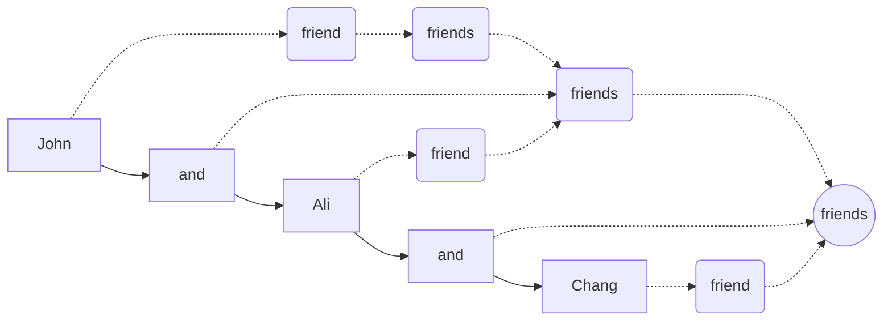

# Context

* What is this?
  * This module describes what syntax means, and the syntax used to describe syntax.
* Why is this important?
  * On the path to learning how to program, understanding and applying the syntax of a programming language is important. Instead of using a "loose" pseudocode syntax, it is more efficient to "learn the real thing" from the get-go!
* How is this done?
  * This is accomplished by using a *meta* syntax language.
 
# Meta syntax

The syntax of a programming language is like the grammatical rules of the programming language. These rules are often specified by some form of meta syntax. One commonly used meta syntax is called [BNF](https://en.wikipedia.org/wiki/Backus%E2%80%93Naur_form) (Backus-Naur form). 

The syntax of C++ is intermediate compared to other programming languages. A plain BNF description of C++ can be difficult to follow. However, a BNF description that makes use of hyperlinks is considerably easier to follow. Fortunately, Alessio Marchetti has already created a [hyperlinked BNF description of the syntax of C++](https://alx71hub.github.io/hcb/).

## How to read the BNF notation

### The basics

Each syntactic rule (also called a "production") consists of two parts:

* the token being defined
* what the token can be expanded to

Let us consider the following example. An [iteration-statement](https://alx71hub.github.io/hcb/#iteration-statement) is describe as follows:

|token|expansion|
|-|-|
|*iteration-statment*|**while (** *condition* **)** *statement* **do** *statement* **while (** *expression* **);**   **for (** *for-init-statmentcondition*opt **;** *expression*opt **)** *statement*  **for (** *for-range-declaration* **:** *for-range-initializer* **)** *statement*

In this syntactic rule, the token *`iteration-statement`* has four alternative expansions as each line of the "expansion" column is one alternative. In each expansion alternative, anything that is **boldface** must be entered verbatim, while anything not in boldface is a token with its own expansion. The subscript "opt" designates the token to be optional. Optional means the same as zero or one occurrence.

Essentially, a token (italicized and not boldfaced) is a placeholder. A placeholder can be holding a space (a position in a sequence) for nothing or many components. A boldfaced item is also known as a "terminal", a terminal specifies the text expected verbatim.

### Repetition

BNF can be used to express the repetition of a pattern. Let us consider the syntactic rule of a `statement-seq` (statement sequence):

|token|expansion|
|-|-|
|*statement-seq*|*statement* *statement-seq statement*|

This shows that there are two alternatives to expand a `statement-seq` token:

* *`statement`*: the first alternative is a simpler token, a single statement.
* *`statement-seq statement`*: the second alternative specifies a statement sequence, followed by a single statement.

### An example

Let us consider an example that does not relate to a complex programming language. For brevity, we will use the following notation:

*`token1`* ::= *`token2`* **blah**

The above example is a rule to expand *`token1`* to *`token2`* followed by the word "blah" verbatim. You can consider the symbol ::= to mean "can expand to".

With this notation, now we define the following rules:

* R1: *`friend`* ::= **Ali**
* R2: *`friend`* ::= **John**
* R3: *`friend`* ::= **Chang**
* R4: *`friends`* ::= *`friend`*
* R5: *`friends`* ::= *`friends`* **and** *`friend`*

Note that R1, R2, and R3 are alternatives to expand *`friend`*, while R4 and R5 are alternatives to expand *`friends`*. A more concise way to represent the same set of rules is as follows:

* *`friend`* ::= **Ali** | **John** | **Chang**
* *`friends`* ::= *`friend`* | *`friends`* **and** *`friend`*

In the concise representation, the vertical bar symbol `|` is used to separate the alternatives to expand the token on the left-hand side of the "::=" symbol. 

Let us consider how the sentence "John and Ali and Chang" is considered syntactically correct as the token *`friends`*.

1. After processing the word "John", R1 fires and recognizes that this is a token *`friend`*.
2. R4 can also now fires and recognize that we also have a *`friends`* token.
3. The next word is "and", R5 is a *candidate* to fire, but we need another *`friend`* token.
4. The next word is "Ali", R1 fires, recognizing it matches the *`friend`* token.
5. R5 now completes its firing because there is a *`friends`* token recognized in step 2, a verbatim "and", and a *`friend`* token recognized in step 4. As R5 fires, now we have a *new* *`friends`* token recognized for the partial text of "John and Ali".
6. The next word is "and", R5 is a candidate to fire, we we need another *`friend`* token.
7. The next word is "Chang", R3 fires, we just recognized another *`friend`* token.
8. R5 now completes its firing because there is a *`friends`* token (corresponding to "John and Ali"), a verbatim word "and", and also a *`friend`* token corresponding to "Change". We now have another *`friends`* token recognized to represent the entire text of "John and Ali and Chang".

Graphically, we can represent it as follows:

In this diagram, solid arrows indicate the flow in the text to be processed, "John and Ali and Chang". Dotted arrows indicate the recognition of a token (think of these arrows as "reversed expansion").

# Exercises

The following is generated by ChatGPT.

1. What is a syntactic rule in BNF?

A syntactic rule in BNF defines how a particular token (non-terminal) can be expanded into other tokens or terminals. It consists of a token being defined and its possible expansions, separated by "::=" or "|".

2. How is repetition expressed in BNF?

Repetition in BNF is expressed by recursive definitions. For example, in the rule:
<pre>
*statement-seq* ::= *statement* | *statement-seq statement*
</pre>
The second alternative allows *statement-seq* to repeat by including itself in the expansion.

3. What does "opt" mean in a BNF description?

"Opt" signifies that the token it is attached to is optional, meaning it may appear zero or one time in the syntactic structure.

4. In the provided "friends" example, how is the sentence "Ali and Chang" parsed?

1. "Ali" matches *`friend`* using R1.
2. R4 recognizes *`friends`*.
3. "and" triggers R5, requiring another *`friend`* token.
4. "Chang" matches *`friend`* using R3.
5. R5 completes, forming a *`friends`* token for "Ali and Chang."

5. What is the difference between a terminal and a non-terminal in BNF?

A **terminal** is a literal string that appears in the final output (e.g., **"while"**, **"and"**). A **non-terminal** (or token) is a placeholder that can be expanded into other non-terminals or terminals.

6. Using the BNF rule <code>*digit* ::= "0" | "1" | "2" | ... | "9"</code>, how can you express a non-negative integer?

A non-negative integer can be expressed as:
<pre>
*integer* ::= *digit* | *integer digit*
</pre>
This allows one or more digits to form a number like "123".

7. How is ambiguity avoided in BNF?

Ambiguity is avoided by clearly specifying alternative expansions for tokens and ensuring that rules do not lead to multiple valid parses for the same input.

8. What is the purpose of using hyperlinked BNF descriptions?

Hyperlinked BNF descriptions make it easier to navigate and understand complex syntax rules by allowing users to click on tokens and immediately view their definitions or expansions.

9. Why is BNF considered a "meta-syntax" language?

BNF is called a meta-syntax language because it describes the syntax of programming languages, which themselves define how code should be written. It operates at a level above the syntax of the programming language being specified.

10. In mathematical terms, how would you describe the recursive rule for <code>*friends*</code>?

The recursive rule can be described as:
<pre>
friends = friend
friends = friends + " and " + friend
</pre>
This is similar to defining a sequence recursively, where the base case is a single friend, and the recursive case adds "and friend" to the existing sequence.

