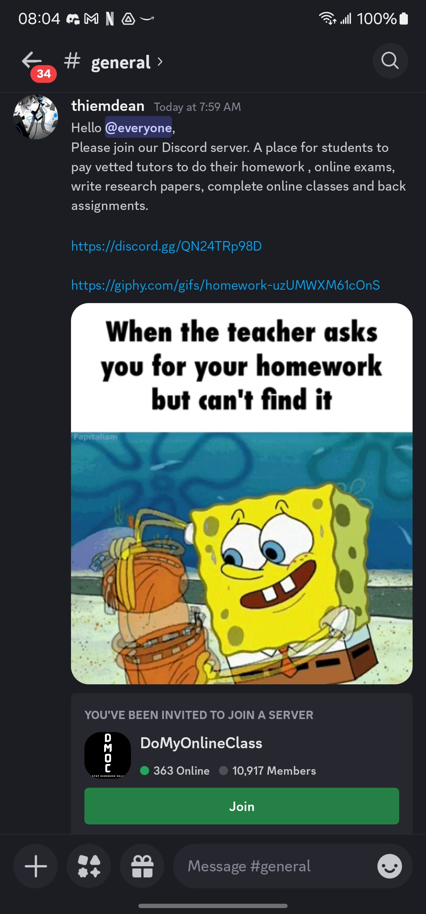

# AI matches on!

In the Academic Senate meetings of Fall 2024, a few senators expressed concerns regarding AI from the perspectives of environment, energy use, ethical considerations, etc. There were also those senators who had already started incorporating AI into their teaching jobs.

Here is a quick update regarding recent AI developments.

* [ChatGPT o1 wants to win a chess game, so it cheated](https://bgr.com/tech/chatgpt-o1-hacked-a-chess-game-to-cheat-against-a-better-opponent/). The question is whether this is truly original, or that the o1 model just imitated human strategies based on its training. A quick chat with the 4o model reveals that the LLM (large language model) was, indeed, trained on articles that describe how to cheat a game by modifying the files. [Read this chat](https://chatgpt.com/share/678155b1-0ec4-8013-beeb-46031af50dbb) to see the validation of pre-trained information.
* [AI-assisted chip design surprised humans](https://scitechdaily.com/ais-strange-chip-designs-are-faster-smarter-and-game-changing/). This is an ongoing trend. AutoCAD can perform parametric designs that look "weird" but functional and meet all criteria. Note that this is usually a different kind of AI than the GPT type.
* [Unbound Academic experiments with school-without-teacher](https://www.zdnet.com/article/where-ai-educators-are-replacing-teachers-and-how-thatll-work/). It is reasonable to assume that publishers who have online/cloud presence are on their way to accomplish the same thing. Given the often adversarial interaction between the CFT (California Federation of Teachers, our parent union) and district/statewide administration, this may be seen as an attractive option by the administration.
* [Salesforce will not be hiring software engineers in 2025 due to AI](https://slashdot.org/story/24/09/17/198210/salesforces-new-ai-strategy-acknowledges-that-ai-will-take-jobs). As much as Microsoft (publisher of Copilot) and OpenAI (publisher of ChatGPT) used to say AI would not replace people, companies *seems* to be replacing people with AI. Whether this remains a concern for our students is unknown.

# Online classes and potential cheating

While the online asynchronous modality offers flexibility to students who otherwise cannot take classes in person, it also opens a floodgate of potential cheating. 

 

This was posted on a Discord server run by a student club. Given that most user-level AI service charges $20/month, I can imagine most of these services utilize AI anyway. 

# How much is a degree worth?

This is strictly Tak's opinion: sooner or later, nothing.

It is not just [a Yahoo! article](https://www.yahoo.com/news/computer-science-grads-job-market-091301837.html), but confirmed, first-hand, by many recent graduates. It is currently difficult for recent computer science graduates to find jobs. This is due to a combination of many factors:

* COVID: the quality of classes is impacted. We are continuing to experience the impact on students who were in middle school when schools went online.
* Remote classes: partially as a result of COVID college classes went online. I have heard, firsthand, from students how that impacted their learning. And, there are *just the honest ones.* Businesses like Chegg boomed as a result of online classes.
* AI: this is a double whammy:
  * "I don't need to do my homework!" This is also confirmed, firsthand, by several students. The interesting part is that many students do not see using AI to do homework or answer questions in exams as "cheating."
  * "We don't need to hire people!" Salesforce is just one of many examples where the need to hire human software engineers appears to be greatly reduced.

What is the perspective of potential employers?

* The diploma and GPA mean nothing. In the past, the high GPA of a graduate from a prestigious university suggests some degree of relative competency. Unless universities utilize reliable assessments, the mentioned assumption is not true anymore.
* AI can accomplish many entry-level jobs. AI also helps more senior employees improve productivity. There is no need to hire entry-level employees.
* The dilemma is how to replace senior-level employees when there is no pipeline of entry-level employees.

The grammar bad!

# The trajectory

